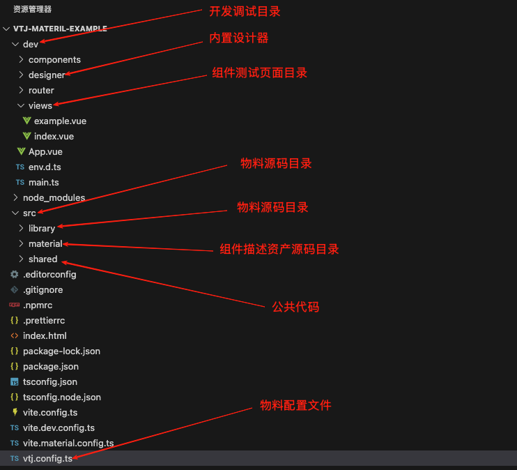
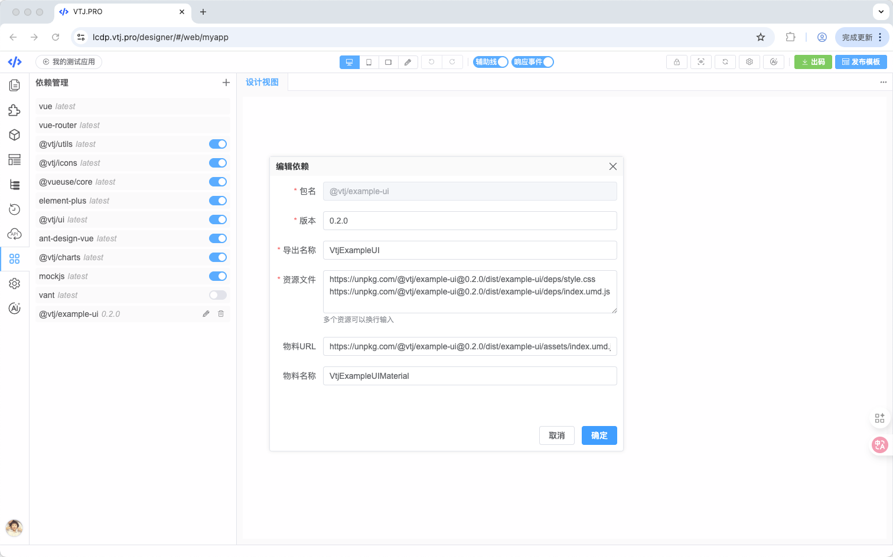

# 物料制作指南

**低代码物料**是低代码开发中预先构建的、可复用的功能模块或组件，旨在通过“搭积木”的方式快速构建应用，避免重复开发。

本指南旨在系统化指导开发者高效构建可复用的低代码物料。

## 物料协议

低代码的**物料协议**在`@vtj/core`中定义。设计器是根据**物料协议**识别项目依赖有哪些组件，组件有哪些属性、事件和插槽，以及用什么设置器给属性赋值。物料描述用`JSON`的格式按协议描述依赖包中的Vue组件。

同时，在设计器的组件库面板也是根据物料描述显示可用的组件

### 物料描述定义

```ts
/**
 *  物料描述
 */
export interface Material {
  /**
   * 版本号
   */
  version: string;

  /**
   * 物料名称标识
   */
  name: string;

  /**
   * 产出导出变量名称
   */
  library: string;

  /**
   * 物料中文名称
   */
  label: string;

  /**
   * 分类配置
   */
  categories: MaterialCategory[];

  /**
   * 组件描述
   */
  components: MaterialDescription[];

  /**
   * 排序号，物料在组件库的排序，数字小的在前
   */
  order: number;

  /**
   * 不显示在组件库面板
   */
  hidden?: boolean;
}

// 资产分类
export interface MaterialCategory {
  // 标识
  id: number | string;
  // 分类名称
  category: string;
}
```

### 组件描述定义

```ts
export interface MaterialDescription {
  /**
   * 组件名称
   */
  name: string;

  /**
   * 组件别名，即组件库导出的原始名称 如 import { Button } from 'ant-design-vue'
   */
  alias?: string;

  /**
   * 组件库导出的名称 如 import { Button } from 'ant-design-vue'
   * parent: Button
   * alias: Group
   * name: AButtonGroup
   * const AButtonGroup = Button.Group;
   * 当 parent 有值时 alias 可以设置多级，如 Group.Item
   *
   */
  parent?: string;

  /**
   * 组件预览图标
   */
  icon?: string;

  /**
   * 组件中文名称描述
   */
  label?: string;

  /**
   * 组件文档Url
   */
  doc?: string;

  /**
   * 分类Id
   */
  categoryId?: number | string;

  /**
   * 组件支持属性，待定义
   */
  props?: MaterialProp[];

  /**
   * 组件支持事件
   */
  events?: Array<string | MaterialEvent>;

  /**
   * 组件支持的插槽
   */
  slots?: Array<string | MaterialSlot>;

  /**
   * 初始化时的低代码片段
   */
  snippet?: Partial<NodeSchema>;

  /**
   * 只能放置在哪些组件内， 如果不设置，则表示可以放置在任何组件内, false表示不能放置在任何组件内
   */
  parentIncludes?: boolean | string[];

  /**
   * 只能允许哪些子组件， 如果不设置，则表示可以放置任何子组件, false表示不能放置在任何子组件
   */
  childIncludes?: boolean | string[];

  /**
   * 不显示在组件面板
   */
  hidden?: boolean;

  /**
   * 组件来源
   */
  from?: NodeFrom;

  /**
   * Block Id
   */
  id?: string;

  /**
   * 所属包名
   */
  package?: string;
}
```

### 属性、事件、插槽、设置器

```ts
/**
 * 组件支持的属性
 */
export interface MaterialProp {
  /**
   * 属性名称
   */
  name: string;

  /**
   * 属性名称 中文
   */
  label?: string;

  /**
   * 提示说明
   */
  title?: string;

  /**
   * 默认值
   */
  defaultValue?: JSONValue;
  /**
   * 设置器
   */
  setters?: string | MaterialSetter | Array<string | MaterialSetter>;

  /**
   * 值可选项
   */
  options?: string[] | { label: string; value: JSONValue }[];

  /**
   * 数据类型
   */
  type?: DataType[];
}

/**
 * 属性设置器
 */
export interface MaterialSetter {
  /**
   * 设置器名称标识
   */
  name: string;

  /**
   * 实现组件
   */
  component?: any;

  /**
   * 显示描述文本
   */
  label?: string;

  /**
   * 组件配置参数
   */
  props?: Record<string, any>;
}

/**
 * 组件支持的事件
 */
export interface MaterialEvent {
  /**
   * 事件名称
   */
  name: string;

  /**
   * 事件回调参数名
   */
  params?: string[];
}

/**
 * 组件支持的插槽
 */
export interface MaterialSlot {
  /**
   * 插槽名称
   */
  name: string;

  /**
   * 插槽回传的参数名
   */
  params?: string[];
}
```

## 物料开发

**开发步骤**

1. 创建物料开发项目
1. 初始化项目配置
1. 配置`vtj.config.ts`
1. UI组件库、工具函数、API等物料编码。
1. 编写UI组件物料描述文件。
1. 编译打包产物
1. 部署

### 创建物料开发项目

VTJ脚手架内置了物料开发项目工程模版，可以通过以下方式创建项目

```bash
npm create vtj@latest --registry=https://registry.npmmirror.com -- -t material
```

项目工程内置一个用 StorageService 的设计器，用于对物料进行测试。

**项目工程目录**



### 初始化项目配置

按需配置 `package.json` 文件中的 `name` 和 `version`。 这两项目配置将会自动写入到物料资产包的 `name` 和 `version` 字段

### 配置 vtj.config.ts

物料配置在工程根目录下的`vtj.config.ts`文件中设置，可按需要设置。

:::warning 注意
重点关注： `library`、 `material` 这两个配置，这个是低代码引擎能识别到物料的关键信息。
:::

```ts
/**
 * 调试项目配置信息
 */
export const project: Record<string, any> = {
  id: name,
  name: '物料开发项目',
  platform: 'web'
};

/**
 * 库导出名称
 */
export const library = 'VX';

/**
 * 物料描述导出名称
 */
export const material = 'VXMaterial';

/**
 * 物料在设计器组件面板中的标题文本
 */
export const label = '扩展库';

/**
 * 库产物文件
 */
export const outputLibrary = ['dist/style.css', 'dist/index.umd.js'];

/**
 * 物料描述产物文件
 */
export const outputMaterial = 'dist/material.umd.js';
```

### UI组件库、工具函数、API等物料编码

完成相关配置后，你就可以进行开发编码的工作。这些代码需要写到 `/src/library` 目录下。 你可以增加UI组件、公共工具函数，甚至API调用方法都可以，这些组件和方法以后都可以设计器中使用。 如果是UI组件别忘记插件注册， 关注文件： `/src/libraray/index.ts` 和 `/src/libraray/ui/index.ts`

:::info 提示
如果你已经有相关工具和组件库，只是缺少物料描述文件，可以跳过该步骤，直接编写物料组件描述文件
:::

**测试组件**

在目录`/dev/views`下创建 `.vue`文件, 会自动创建路由，在这个文件可以写测试组件代码。


### 编写UI组件物料描述文件

低代码引擎和设计器是通过组件物料描述文件来识别依赖有哪些可用的Vue组件， 组件有什么属性参数、事件和插槽，以及组件的属性是采用哪种设置器来赋值。 因此这个文件是关键的数据。

组件物料描述文件写到`/src/materila/`目录下。 需要在 `/src/materila/index.ts` 进入新建的文件。

**一个组件物料描述的示例**

```ts
import type { MaterialDescription } from '@vtj/core';

const desc: MaterialDescription = {
  name: 'VExample',
  label: '示例组件',
  categoryId: 'base',
  props: [
    {
      name: 'title',
      setters: 'StringSetter'
    },
    {
      name: 'content',
      label: '内容',
      title: '鼠标经过提示文字',
      setters: ['StringSetter', 'ArraySetter']
    }
  ],
  events: [
    {
      name: 'change',
      params: ['data']
    }
  ],
  slots: [
    {
      name: 'default',
      params: ['data']
    },
    {
      name: 'footer'
    }
  ]
};

export default desc;
```

上传示例，描述了组件有 title、content 两个属性参数，title用文本设置器，content可用文本和数据JSON的设置器； 有一个change事件，和两个插槽。

**以下是可用的内置设置器：**

```ts
export const builtInSetters: Array<Setter> = [
  {
    name: 'InputSetter',
    component: setters.StringSetter,
    type: 'String'
  },
  {
    name: 'StringSetter',
    component: setters.StringSetter,
    type: 'String'
  },
  {
    name: 'BooleanSetter',
    component: setters.BooleanSetter,
    type: 'Boolean'
  },
  {
    name: 'ExpressionSetter',
    component: setters.ExpressionSetter,
    type: 'Object'
  },
  {
    name: 'SelectSetter',
    component: setters.SelectSetter,
    type: 'String'
  },
  {
    name: 'NumberSetter',
    component: setters.NumberSetter,
    type: 'Number'
  },
  {
    name: 'ColorSetter',
    component: setters.ColorSetter,
    type: 'String'
  },
  {
    name: 'IconSetter',
    component: setters.IconSetter,
    type: 'String'
  },
  {
    name: 'VanIconSetter',
    component: setters.VanIconSetter,
    type: 'String'
  },
  {
    name: 'ObjectSetter',
    component: setters.JsonSetter,
    type: 'Object',
    props: {
      type: 'Object'
    }
  },
  {
    name: 'ArraySetter',
    component: setters.JsonSetter,
    type: 'Array',
    props: {
      type: 'Array'
    }
  },
  {
    name: 'JsonSetter',
    component: setters.JsonSetter,
    type: 'Object',
    props: {
      type: 'JSON'
    }
  },
  {
    name: 'JSONSetter',
    component: setters.JsonSetter,
    type: 'Object',
    props: {
      type: 'JSON'
    }
  },
  {
    name: 'FunctionSetter',
    component: setters.FunctionSetter,
    type: 'Function'
  },
  {
    name: 'RadioSetter',
    component: setters.RadioSetter,
    type: 'String'
  },
  {
    name: 'TagSetter',
    component: setters.TagSetter,
    type: 'String'
  },
  {
    name: 'SizeSetter',
    component: setters.SizeSetter,
    type: 'String'
  },
  {
    name: 'ImageSetter',
    component: setters.ImageSetter,
    type: 'String'
  },
  {
    name: 'SectionSetter',
    component: setters.SectionSetter,
    type: 'String'
  },
  {
    name: 'SliderSetter',
    component: setters.SliderSetter,
    type: 'Number'
  },
  {
    name: 'RangeSetter',
    component: setters.SliderSetter,
    type: 'Array',
    props: {
      range: true
    }
  },
  {
    name: 'FileSetter',
    component: setters.FileSetter,
    type: 'String',
    props: {
      multiple: false
    }
  },
  {
    name: 'FilesSetter',
    component: setters.FileSetter,
    type: 'String',
    props: {
      multiple: true
    }
  },
  {
    name: 'CssSetter',
    component: setters.CssSetter,
    type: 'String'
  }
];
```

**物料测试**

测试组件物料描述，无须编译可在内置的设计器调试。


### 编译打包产物

物料开发完成 `npm run build` 进行编译打包。产物如下：


产物可以发布npm 或 git等，可自行决定使用方式。

### 部署到设计器

编译后的产物提供给设计器用， 步骤：

1. package.json 添加物料的依赖（如果是发布npm、 git），其他方式需要设置 vite.config.ts alias
1. 在设计器的依赖管理添加物料依赖。 资源文件可以是绝对路径 或 文件放置项目`public`目录下，用 `/`开头的路径。


