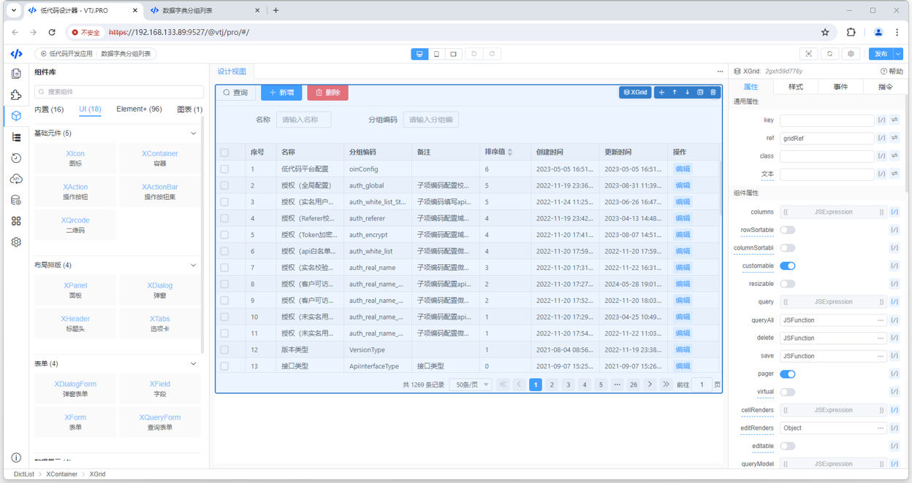

# VTJ低代码设计器入门系列（一）：项目工程搭建和配置

VTJ是一款基于 Vue3 + TypeScript 的低代码开发工具，内置可视化设计器，可用来开发Vue3的前端应用。

官方提供了开箱即用的项目脚手架，可以快速创建基于VTJ低代码的开发项目工程，并默认最佳实践的配置，非常适用新项目开发。

:::warning 开发环境要求
VTJ 使用了最新的 Vue3 生态技术栈，要求 Node 版本必须是 v20+， 建议使用 nvm 切换 Node 版本
:::

## 使用脚手架创建项目

打开终端工具输入命令运行

```sh
npm create vtj@latest -- -t app
```

如npm访问不了，可以尝试使用镜像：

```sh
npm create vtj@latest --registry=https://registry.npmmirror.com -- -t app
```

项目创建完成后进入，按提示进入目录 安装依赖 和 启动开发环境

```sh
npm run setup && npm run dev
```

看到以下页面，项目已正常运行，你可以开始使用设计器以低代码的方式开发应用了。


按提示点击开始设计按钮，即可打开设计器。


