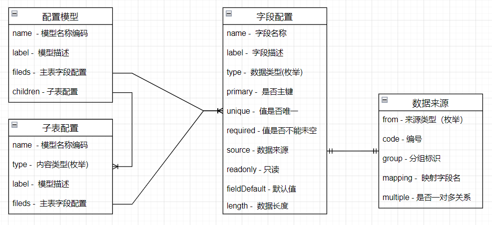
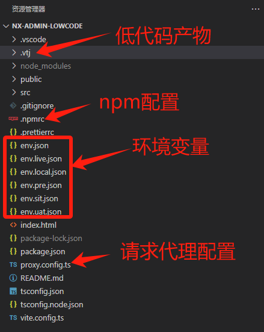
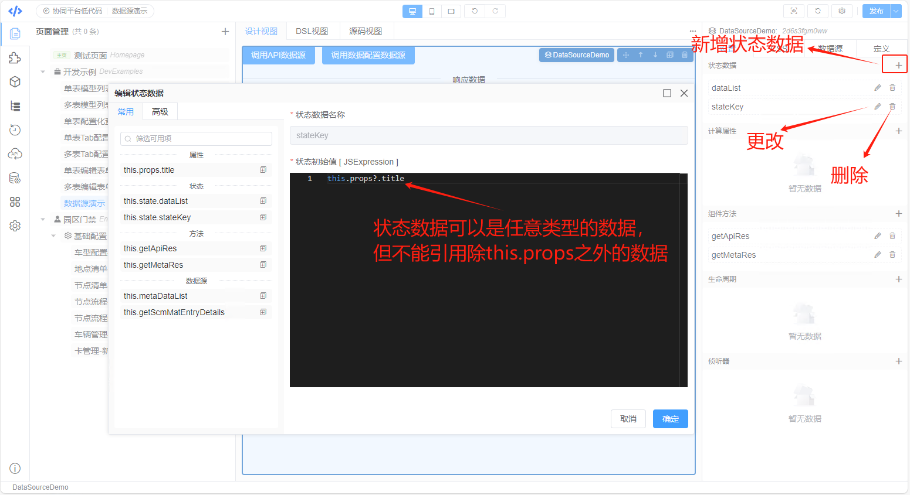
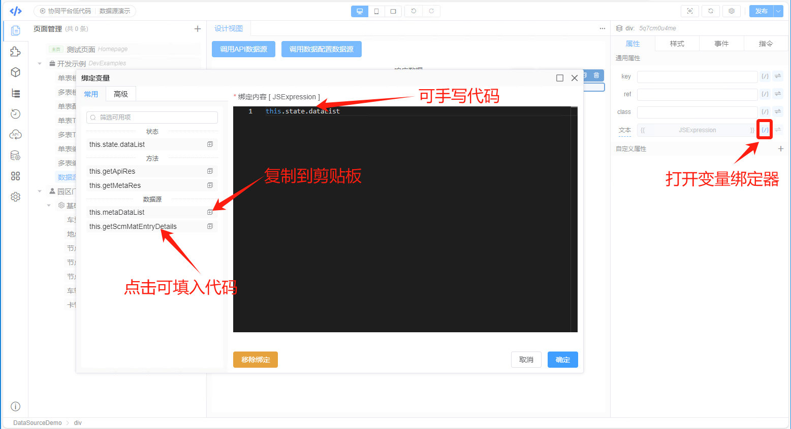
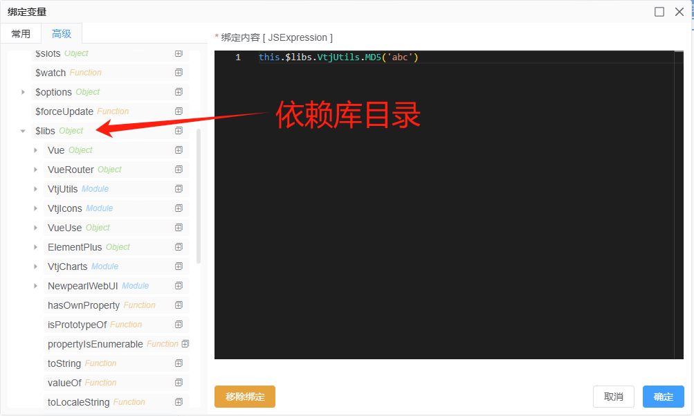
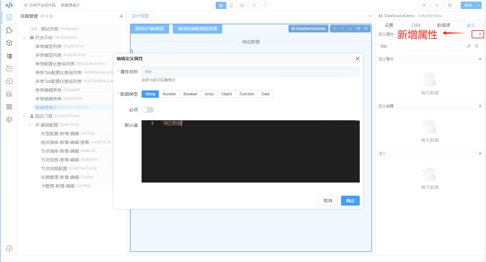
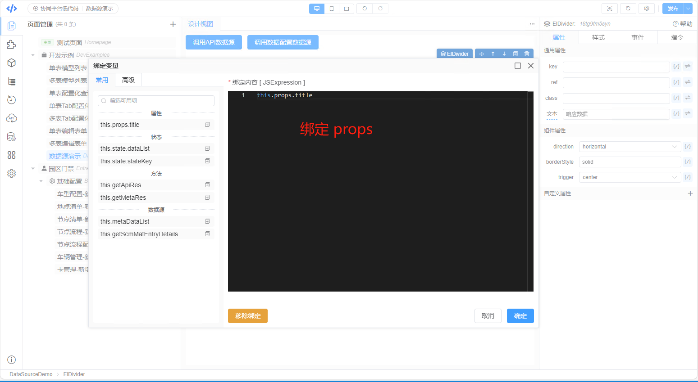
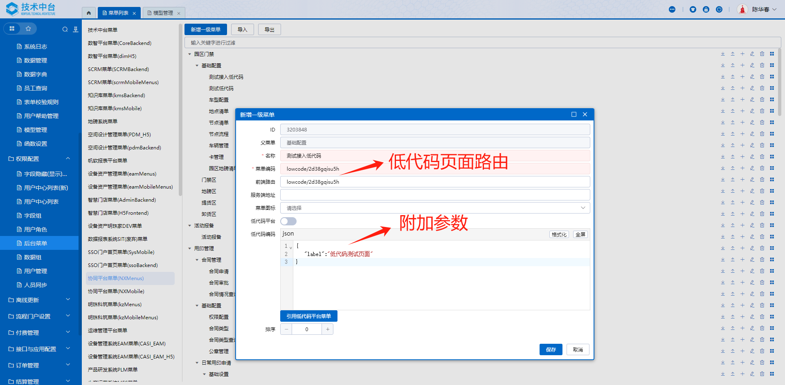
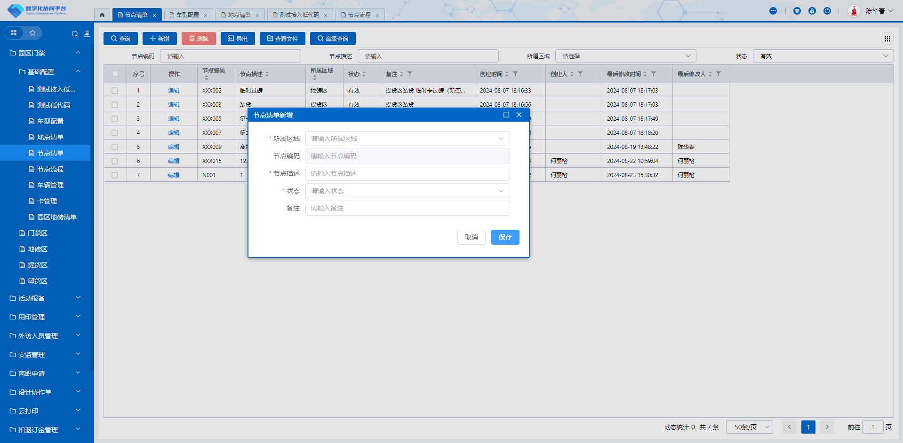

# 自研低代码开发平台

## 背景

- 数式低代码推进过程中遇到障碍（需求、用户习惯、开发学习、组件适配成本等方面原因）
- 没有一款产品能高度匹配现有业务场景和用户习惯的交互方式

为了更好的与自有业务结合，采取自建低代码平台的方案。

## 自建方案


- 借鉴数式“低无一体”理念，采用协议驱动模式
- 深度融合技术中台，充分利用现有基建
- 配置化生成可读源码，支持代码级别个性化定义
- 高度复刻现有系统交互方式，开发人员无学习心智负担

## 开发流程

低代码应用的开发流程：

1. 架构师根据需求搭建低代码开发工程，并且改造原业务应用与低代码应用融合。 低代码应用工程项目名称带有 `lowcode` 后缀，如： `nx-admin-lowcode`，运维配合接入jenkins，配置nginx采用二级目录形式访问低代码应用。
1. 后端开发在技术中台设计模型，完成模型相关配置，如表关联、数据来源、字段信息等。
1. 前端开发使用低代码设计器完成需求功能开发。如内置的组件实现不了需求，需报架构评估，决定实现方式（改造组件、新增组件、高代码实现）
1. 完成功能开发后，在设计器上整站发布，低代码产物需提交 `gitlab`。
1. jenkins完成发布部署。

## 数据模型

数据模型配置是无代码开发的一种方法， 并不是低代码开发的前提条件。 通过模型配置可以简化低代码开发过程。

数据模型管理在技术中台：数据管理 > 模型管理 菜单

通过模型配置可实现单表或多表的基础通用增、删、查、改， 个性化需求可使用设计器进行调整。

### 模型定义



```ts
/**
 * 子表内容类型
 */
export type MetaModelChildType = 'grid' | 'custom' | string;

/**
 * 字段数据类型
 */
export type MetaModelFieldType =
  | 'String'
  | 'Number'
  | 'Int'
  | 'Boolean'
  | 'Date'
  | 'DateTime'
  | 'Dict'
  | 'DictArray'
  | 'Meta'
  | 'MetaArray'
  | 'Money'
  | 'HTML'
  | 'JSON'
  | 'Hidden';

/**
 * 字段数据来源
 */
export type MetaModelSourceFrom = 'dict' | 'meta' | 'parent';
```

### 模型自带功能

根据上述的模型定义，以下功能可通过配置模型无码开发实现：

- 主从表关系，字段显示、排序
- 字段是否可编辑，指定字段编辑器
- 指定字段数据来源绑定，支持数据字典、数据配置、主表数据
- 字段联动绑定关联数据
- 字段唯一值、必填值校验

### 模型管理演示

:::info 数据模型管理sit环境链接
[https://sys-sit.newpearl.com/#/lowcode/22nhu3xrdsm?label=%E6%A8%A1%E5%9E%8B%E7%AE%A1%E7%90%86](https://sys-sit.newpearl.com/#/lowcode/22nhu3xrdsm?label=%E6%A8%A1%E5%9E%8B%E7%AE%A1%E7%90%86)
:::

## 低代码开发

### 项目工程

:::warning 开发环境要求
Node 版本必须是 v20+， 建议使用 nvm 切换 Node 版本。
:::



设计器生成的文件存储在工程根目录 `.vtj` 文件夹，不能删除，同时需要把文件提交gitlab。

#### npm 私库

以 `@newpearl/`前缀的依赖包需要从npm私库获取，首次使用需要登录私库

```sh
npm login --registry=https://nexus.newpearl.com/repository/frontend-public
# username：dev
# password：newpearl
```

#### 内置命令

- `npm run setup` 安装依赖
- `npm run dev` 运行开发环境
- `npm run clean` 清空依赖和产物，当依赖包的版本更新后，需要先清理再setup才能获取到新的版本
- `npm run build:sit` 打包sit
- `npm run build:uat` 打包uat
- `npm run build:prod` 打包live
- `npm run preview` 预览打包产物

### 相关概念

为了更好描述低代码的工作过程，需要了解以下概念。

- **协议**
  —— 指低代码开发平台组件、页面的描述约定。

- **DSL**
  —— 领域特定语言，指根据协议对低代码页面的描述，是JSON格式的数据。

- **页面**
  —— 指使用设计器创建的vue单文件组件，带有路由，发布后可通过路由 `/page/页面ID` 访问。

- **区块**
  —— 指使用设计器创建可复用的vue单文件组件，不包含路由，可被页面或其他区块引用。

- **物料**
  —— 指带有低代码协议描述的vue组件

  ### 工作流


### 设计器

:::tip 开发理念
模型只管数据，所有个性化设置都可以通过设计器来完成
:::

#### 入口链接

启动低代码开发环境，在页面的右下角右编辑的图标，点击可进入到设计器并打开当前页面的设计模式


#### 功能分区

低代码设计器采用骨架分区的方式构建，功能有以下区域， 没个区域下内置了响应的功能组件`Widget`


- **品牌区：** 包含品牌Logo、显示当前打开的项目和正在编辑组件，点击链接可返回当前页面组件的源码预览模式
- **工具区：** 模拟器视图切换、当前编辑文件的操作历史记录导航
- **操作区：** 文件预览、页面刷新、页面设置、发布
- **应用区：** 页面管理、区块管理、物料组件库、当前编辑的页面大纲树结构、当前文件编辑历史记录、API管理、数据配置管理、依赖管理、项目配置
- **工作区：** 当前文件的设计视图、DSL视图、源码视图、帮助文档、~~物料市场~~
- **设置区：** 页面设置（状态数据、计算属性、组件方法、生命周期、watch、css、数据源、组件定义），节点设置（属性、样式、事件、指令）
- **状态区：** 当前正在设置的节点信息、~~错误报告~~

#### 操作步骤

功能的实现思路与手写代码开发方式一致。

1. 新建页面，如页面复杂，可拆分区块
1. 新增API、数据配置，如果是公共模块的API，如 core、file、meta、sys、search、user 等，可以在UI库内置。
1. 从组件库面板拖拽需要的组件到设计视图
1. 设置页面需要的状态、属性、方法、事件、生命周期、样式等
1. 给节点设置属性、绑定变量
1. 完成功能，预览、发布

#### 常用功能

以下常见的功能实现方式、技巧及注意事项。

##### 状态数据



:::tip
由于组件状态是在组件实例化之前初始化，即在组件setup中完成，因此不能调用组件的实例，但是可调用 `this.props`
:::

##### 变量绑定

在设计器可以给组件节点绑定动态属性或事件变量



- **常用** 选项卡是自己定义，经常需要用到的，如：可用的上下问（插槽数据，循环项数据）、状态数据据、计算属性、方法、数据源、ref引用。
- **高级** 选项卡是当前可的全部内容，包括组件的实例，内置工具库、组件库、依赖等

  :::tip 最佳实践
  绑定器支持手写代码，但不要滥用，如果通过一行代码无法完成的，应该在页面设置中定义状态数据、计算属性、方法等，再绑定。
  :::

高级就是当前组件实例能使用到的变量，其中 `this.$libs`储存了项目依赖包。



:::danger 注意
读取 `$libs` 目前还不支持析构
:::

例如：
如果需要用到`VtjUtils`库的某些方法，您不能写以下的代码

```js
const { VtjUtils } = this.$libs;
const { MD5 } = this.$libs.VtjUtils;
```

可以直接引用，代码生成器会分析依赖优化转换为按需引用，如：

```js
this.$libs.VtjUtils.MD5;
```

##### 页面传参

低代码页面之间的跳转与手写代码开发的方式一致，使用 `this.$router`， 页面参数传递统一使用 `query`

:::info 最佳实践
页面接受参数，通过定义 `props`，自动初始化
:::

定义组件Props



绑定Props



### 系统集成

低代码页面与现有系统集成支持以下三种方式

#### 页面引用

在框架引用页面，需要在菜单配置页面路由。 路由编码需要以 `lowcode/` 前缀，格式： `lowcode/低代码页面Id`。 参数可以在 `低代码编码`中配置JSON数据



#### 弹窗引用

通过弹窗的方式打开低代码页面， 可以使用 `XLowCodeDialog` 实现

```vue
<template>
  <XLowCodeDialog
    :url="url"
    title="车辆管理-新增"
    :width="1200"
    :height="700"
    :bodyPadding="false"
    :minimizable="false">
  </XLowCodeDialog>
</template>
<script>
  import { XLowCodeDialog } from '@newpearl/ui';
  export default {
    components: {
      XLowCodeDialog
    },
    data() {
      return {
        url: `${process.env.LOW_CODE}#/page/2357x57ai6e`
      };
    }
  };
</script>
```



#### 内嵌引用

低代码页面当成子组件内联引用，实现一个页面部分内容可以使用低代码开发。

### 开发示例

[https://192.168.133.89:9600/lowcode/](https://192.168.133.89:9600/lowcode/)

- 单表单模型列表 》 单表编辑表单
- 多表单模型列表 》 多表编辑表单
- 单表配置化查询列表
- 单表Tab配置化查询列表
- 多表Tab配置化查询列表
- 数据源演示
