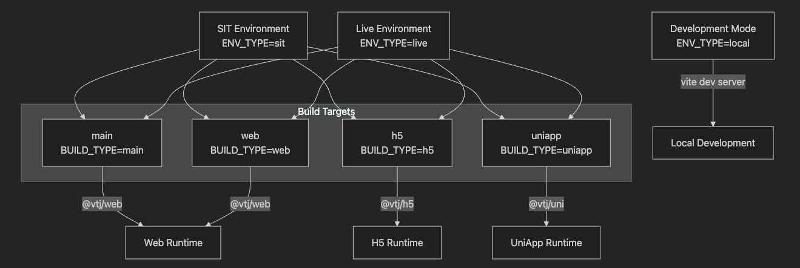

# 多平台构建系统

## 目的和范围

本文档介绍了 VTJ 低代码开发平台的多平台构建系统，该系统支持跨多个目标平台（Web、H5、UniApp）进行部署，并支持不同的环境（SIT、Live）。构建系统利用 VTJ 生态系统包，并为跨平台部署提供自动化编译工作流。

有关整体项目结构的信息，请参阅项目结构 。有关开发设置和配置的详细信息，请参阅 开发配置 。

## 构建环境

构建系统支持两个主要部署环境，每个环境都有不同的配置和优化设置：

| 环境 | 目的           | 环境变量      | 构建脚本                                             |
| ---- | -------------- | ------------- | ---------------------------------------------------- |
| SIT  | 集成测试和暂存 | ENV_TYPE=sit  | sit：main， sit：web， sit：h5， sit：uniapp         |
| LIVE | 生产部署       | ENV_TYPE=live | build：main， build：web， build：h5， build：uniapp |

### 环境配置流程

## 平台目标

构建系统为四个不同的平台目标生成优化的捆绑包，每个目标都使用特定的 VTJ 生态系统包：

### 构建目标架构

### 特定于平台的配置

| 平台   | 生成类型          | 运行时包 | 目标用例               |
| ------ | ----------------- | -------- | ---------------------- |
| 主应用 | BUILD_TYPE=main   | @vtj/web | 功能齐全的核心应用程序 |
| Web    | BUILD_TYPE=web    | @vtj/web | 标准 Web 浏览器部署    |
| H5     | BUILD_TYPE=h5     | @vtj/h5  | 移动 Web 应用程序      |
| UniApp | BUILD_TYPE=uniapp | @vtj/uni | 跨平台移动应用程序     |

## VTJ 生态系统集成

构建系统通过运行时依赖项和开发工具与 VTJ 生态系统紧密集成：

### 运行时依赖项

- **@vtj/web**：Web 平台运行时引擎
- **@vtj/h5**：H5 移动 Web 运行时引擎
- **@vtj/uni**：UniApp 跨平台运行时引擎
- **vue**：Core Vue.js 框架 （~3.5.0）
- **vue-router**：客户端路由 （~4.5.0）

### 开发工具

- **@vtj/cli**：用于 VTJ 作的命令行界面
- **@vtj/pro** ：专业的开发工具和实用程序

## 构建脚本编排

构建系统提供对各个平台构建和全面批处理作的精细控制：

### 单个平台脚本

### 批量构建作

系统提供了两个全面的构建命令，可按顺序执行所有平台目标：

- **npm run sit**：执行 sit：main、sit：web、sit：h5、sit：uniapp
- **npm run build**：执行 build：main、build：web、build：h5、build：uniapp

## 部署和分发

构建系统在 dist/ 目录结构中生成可部署的工件，每个平台目标都创建自己的子目录。package.json 中的 files 数组指定 npm 包分发中包含哪些工件：

- **dist/** - 所有已编译的平台 bundle
- **package.json** - 包元数据和依赖项
- **README.md** - 文档
