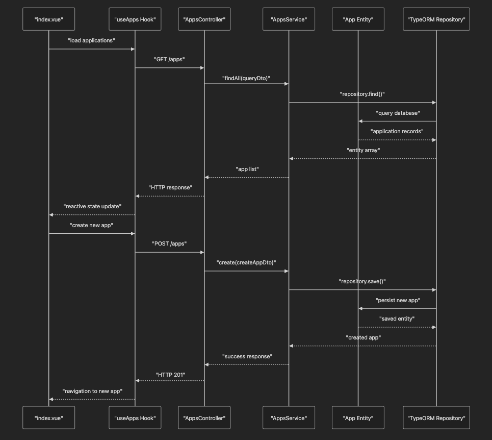

# 架构概述

本文档简要概述了 VTJ 低代码开发平台架构，包括前端组件、后端模块和多平台构建系统之间的关系。它涵盖了支持平台低代码开发功能的整体系统设计模式和核心架构决策。

具体前端组件的详细实现请参见 前端组件 。有关后端服务实施的详细信息，请参阅后端服务 。有关构建系统配置，请参阅多平台构建系统 。

## 系统架构

VTJ 平台遵循现代全栈架构，在表示层、业务逻辑层和数据持久层之间实现了明确分离。该系统旨在支持多个部署目标，同时保持单个代码库。

### 整体系统架构

### 后端模块依赖项

后端遵循 NestJS 模块化架构，业务模块和基础设施服务之间有明确的依赖关系。

## 前端-后端通信流程

前端组件通过 RESTful API 与后端服务通信，状态管理由 Vue 组合式 API 钩子处理。

### 应用程序管理数据流

## 多平台构建架构

该平台通过利用 VTJ 生态系统软件包的统一构建系统支持多个部署目标。

### 构建目标架构

## 模块交互模式

### 服务层依赖项

后端服务遵循分层架构，具有由 NestJS 管理的明确依赖关系注入模式。

### 数据流模式

该平台实现了几个关键的数据流模式：

1. 请求-响应模式 ：前端钩子通过 HTTP API 与后端控制器通信
1. 事件驱动更新 ：状态更改通过 Vue 的响应式系统传播
1. 分层访问控制 ：权限在访问控制树中级联
1. 多层缓存 ：应用程序和基础设施级别的数据缓存

### 跨领域关注点

该架构通过以下方式解决横切关注点：

- 身份验证 ：OAuth 与 Gitee 和会话管理的集成
- 授权 ：具有基于角色的权限的分层访问控制系统
- 缓存 ：具有可配置 TTL 和命中跟踪的全局缓存模块
- 日志记录 ：用于审计跟踪和调试的集中式报告模块
- 配置 ：用于环境特定配置的设置模块
- 文件管理 ：用于安全文件上传和存储的 OSS 模块
