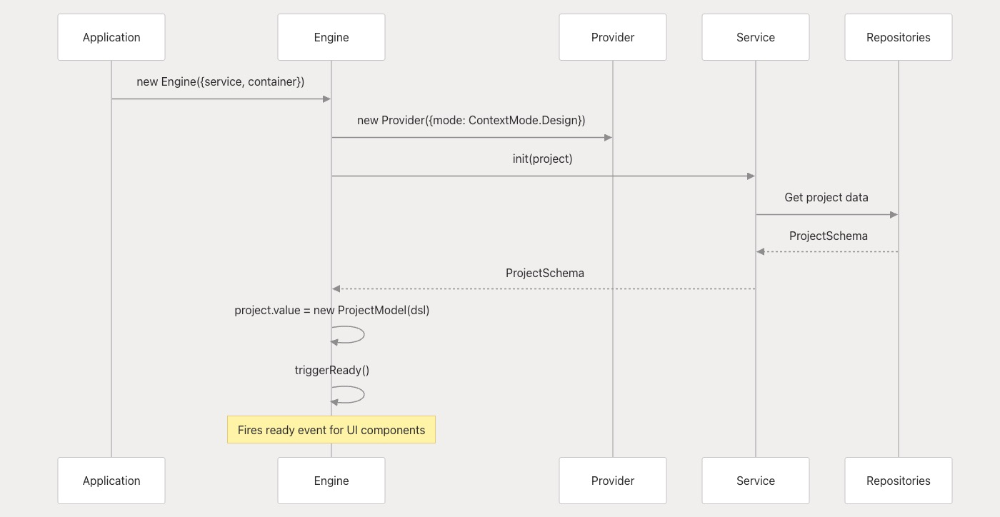
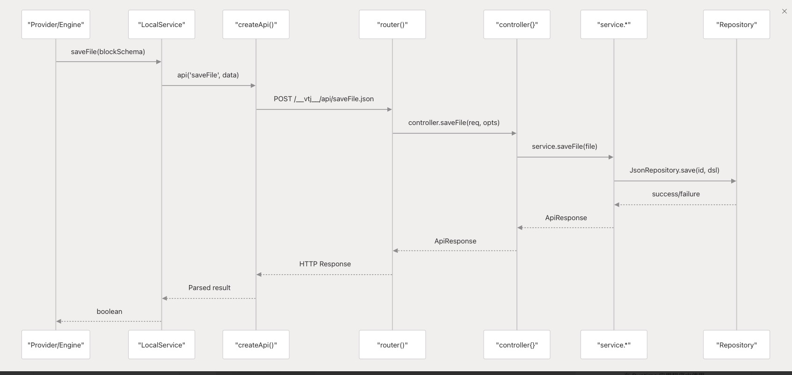
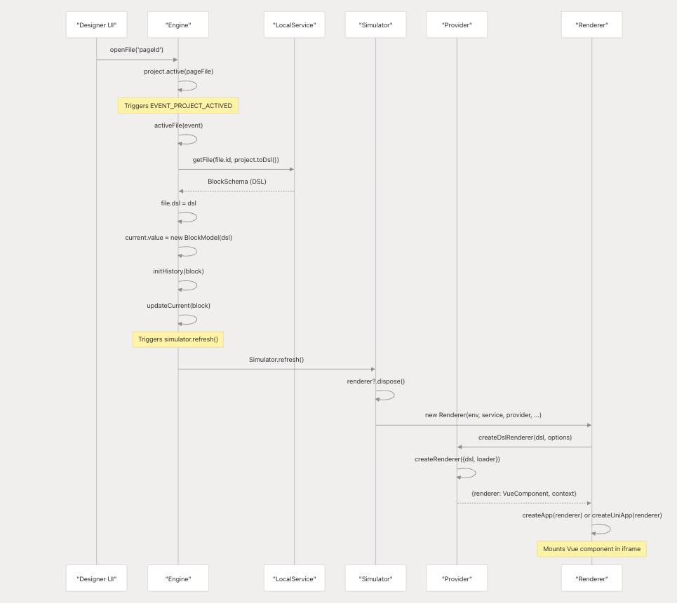

# 引擎、提供程序和服务

本文档详细介绍了 VTJ 低代码平台架构的基础组件：引擎、提供程序和服务层。这三个组件构成了平台在视觉设计和 Vue 源代码之间进行转换的能力的基础，管理设计时和运行时作。有关这些组件处理的数据模型的信息，请参阅工程模型和块模型 。

## 核心架构模式

VTJ 平台使用 Engine-Provider-Service 模式来分离设计时环境、运行时环境和后端服务的关注点

**VTJ 核心架构：引擎-提供程序-服务模式**


## 引擎

引擎是设计时环境的核心组件，用于编排工程模型、模块编辑和仿真功能。

### 引擎属性和初始化

该 Engine 类通过几个关键属性管理整个设计时状态：

| 属性      | 类型                  | 描述                     |
| --------- | --------------------- | ------------------------ |
| service   | Service               | 用于文件作的后端服务     |
| provider  | Provider              | 用于渲染的运行时提供程序 |
| simulator | Simulator             | 管理画布渲染             |
| project   | `Ref<ProjectModel> `  | 当前加载的项目           |
| current   | `Ref<BlockModel>`     | 当前编辑的块             |
| access    | Access 身份验证和授权 |
| history   | `Ref<HistoryModel>`   | 撤消、重做历史记录堆栈   |

```ts
// Engine initialization
const engine = new Engine({
  container: containerElement, // UI container
  service: localService, // Backend service
  materialPath: '/', // Material assets path
  adapter: adapterInstance, // Runtime adapter
  remote: 'https://lcdp.vtj.pro' // Remote server URL
});
```

### 引擎生命周期事件

引擎绑定到各种发射器事件以处理编辑器生命周期：

```ts
emitter.on(EVENT_PROJECT_CHANGE, (e) => this.saveProject(e));
emitter.on(EVENT_BLOCK_CHANGE, (e) => this.changeFile(e));
emitter.on(EVENT_NODE_CHANGE, () => this.changeCurrentFile());
emitter.on(EVENT_PROJECT_PUBLISH, () => this.publish());
emitter.on(EVENT_PROJECT_FILE_PUBLISH, () => this.publishCurrent());
```

### 初始化流程



## 提供商

Provider 充当设计时模型和运行时环境之间的桥梁。它负责加载依赖项、材料，并为渲染块和页面提供上下文。

### 提供程序属性和初始化

| 属性       | 类型                     | 描述                         |
| ---------- | ------------------------ | ---------------------------- |
| mode       | ContextMode              | 作模式（设计、原始、运行时） |
| service    | Service                  | 后端服务接口                 |
| project    | ProjectSchema            | 加载的项目架构               |
| library    | Record<string, any>      | 加载的库依赖项               |
| components | Record<string, any>      | 组件定义                     |
| apis       | Record<string, Function> | API 函数                     |

```ts
// Provider initialization
const { provider, onReady } = createProvider({
  mode: ContextMode.Runtime, // Operating mode
  service: localService, // Backend service
  materialPath: '/materials', // Material assets path
  dependencies: {
    // Frontend dependencies
    Vue: () => import('vue'),
    VueRouter: () => import('vue-router')
  }
});
```

### 加载过程

Provider 通过其 `load` 方法加载项目依赖项和资产：


### 渲染组件

Provider 可以从 DSL 架构创建渲染器

```ts
// Get a render component for a file ID
const component = await provider.getRenderComponent('pageId');

// Create a renderer for a DSL schema
const { renderer, context } = provider.createDslRenderer(dslSchema);
```

## 服务层

Service Layer 为后端作提供抽象，为项目数据、文件管理和代码生成定义接口。它由多个级别组成：抽象的 `Service` 接口、基本实现和针对不同部署场景的特定服务类。

### 服务接口层次结构

#### 核心服务接口

`Service` 抽象类定义了所有后端作的 Contract：

| 方法组   | 关键方法                                       | 目的             |
| -------- | ---------------------------------------------- | ---------------- |
| 配置     | getExtension（） 和 init（）                   | 项目初始化和配置 |
| 项目管理 | saveProject（）、saveMaterials（）             | 项目级作         |
| 文件操作 | saveFile（）、getFile（）、removeFile（）      | 块、页 CRUD      |
| 历史管理 | saveHistory（） 的 getHistoryItem（）          | 撤消、重做功能   |
| 代码生成 | publish（）， genVueContent（）， parseVue（） | 双向代码转换     |
| 资产管理 | uploadStaticFile（）、getStaticFiles（）       | 静态资源处理     |

#### Service Layer 架构


### LocalService 实现

`LocalService` 通过 API 控制器与本地开发服务器通信来处理本地开发：

```
// LocalService request flow
LocalService.init(project)
  -> this.api('init', project)
  -> POST /__vtj__/api/:type.json
  -> controller.init(req, opts)
  -> service.init(body, opts)
  -> JsonRepository.get(projectId)
```

#### LocalService 作映射

| LocalService  | 方法 | API 终端节点      | 控制器功能             | 存储库作                           |
| ------------- | ---- | ----------------- | ---------------------- | ---------------------------------- |
| init()        | POST | /init.json        | controller.init        | JsonRepository.get()               |
| saveProject() | POST | /saveProject.json | controller.saveProject | JsonRepository.save()              |
| saveFile()    | POST | /saveFile.json    | controller.saveFile    | JsonRepository.save()              |
| publish()     | POST | /publish.json     | controller.publish     | generator() + VueRepository.save() |

### 存储库层实现

存储库层为不同的数据类型提供特定的存储实现：

| 存储库类         | 存储位置                     | 数据类型                   | 关键方法                                |
| ---------------- | ---------------------------- | -------------------------- | --------------------------------------- |
| JsonRepository   | .vtj/projects/， .vtj/files/ | ProjectSchema、BlockSchema | get（）、save（）、remove（）           |
| VueRepository    | .vtj/vue/                    | 生成的 Vue 文件            | save（）、remove（）                    |
| StaticRepository | public/static/               | 图片、资产                 | save（）、getAllFiles（）               |
| PluginRepository | package.json                 | 插件定义                   | getPlugins()                            |
| UniRepository    | src/                         | Uni-app 配置               | saveManifestJson（）、savePagesJson（） |

### 服务层请求流程

**API 请求处理**



## 组件之间的数据流

### 设计时到运行时流程

引擎文件加载和渲染过程



### 代码生成和发布流程

引擎发布到 Vue 代码生成


## 集成示例

### 在 Runtime 应用程序中使用 Provider

```ts
// Create a provider for runtime mode
const { provider, onReady } = createProvider({
  mode: ContextMode.Runtime,
  service: new LocalService(createServiceRequest(notify)),
  adapter: createAdapter({
    loading,
    notify,
    useTitle,
    alert
  }),
  dependencies: {
    Vue: () => import('vue'),
    VueRouter: () => import('vue-router')
  }
});

// When provider is ready, render a component
onReady(async () => {
  app.use(provider);

  renderer.value = await provider.getRenderComponent(
    route.params.id.toString(),
    (file) => {
      setupPageSetting(app, route, file);
    }
  );
});
```

### 在设计环境中使用 Engine

```ts
// Create an engine for design mode
const engine = new Engine({
  container,
  service,
  materialPath: __BASE_PATH__,
  pageBasePath: base === '/' ? '' : base,
  adapter,
  access: __ACCESS__,
  remote,
  auth,
  checkVersion
});

// When engine is ready, open a file
engine.ready(() => {
  engine.openFile(route.query.id as string);
});
```

## 服务层集成模式

### 运行时提供程序集成

运行时模式下的 Provider Service 集成


### 访问控制集成

访问跨层插件集成


## 总结

Engine、Provider 和 Service 构成了 VTJ 低代码平台的架构基础：

- **引擎**：管理设计时环境、项目模型和可视化编辑器
- **提供程序** ：处理运行时依赖项、组件渲染和应用程序上下文
- **Service**：定义具有各种实现的后端作接口

这些组件共同实现了可视化设计和代码生成之间的双向工作流程，这是 VTJ 平台的核心。
